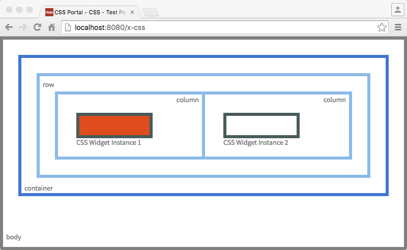
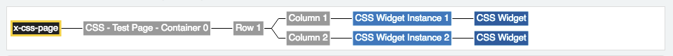
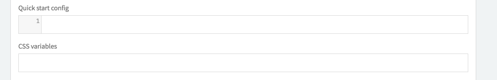
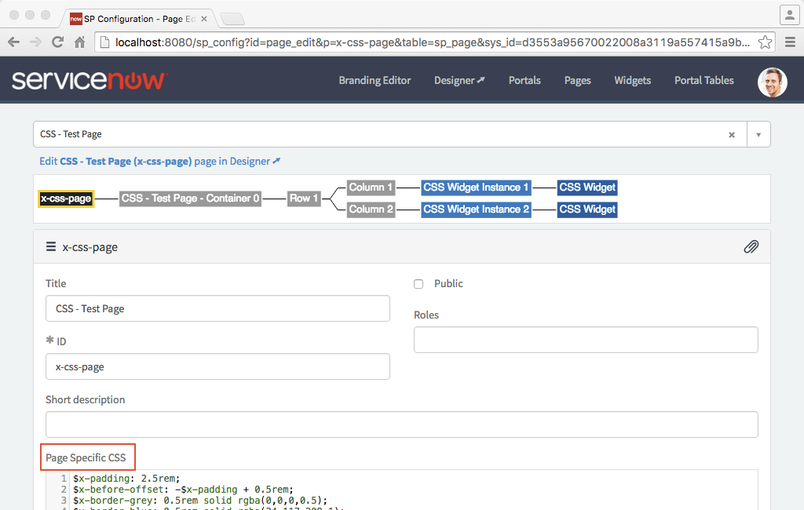
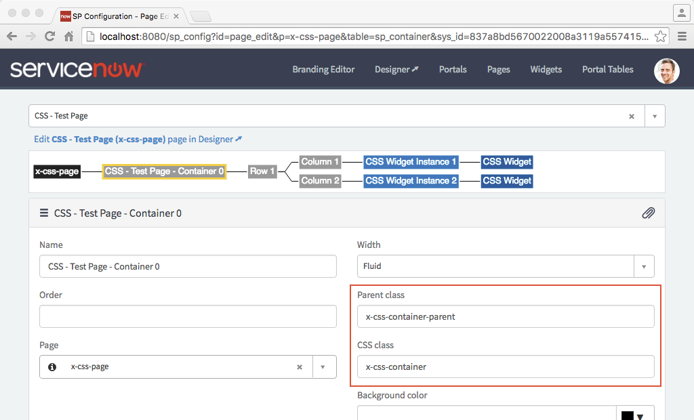
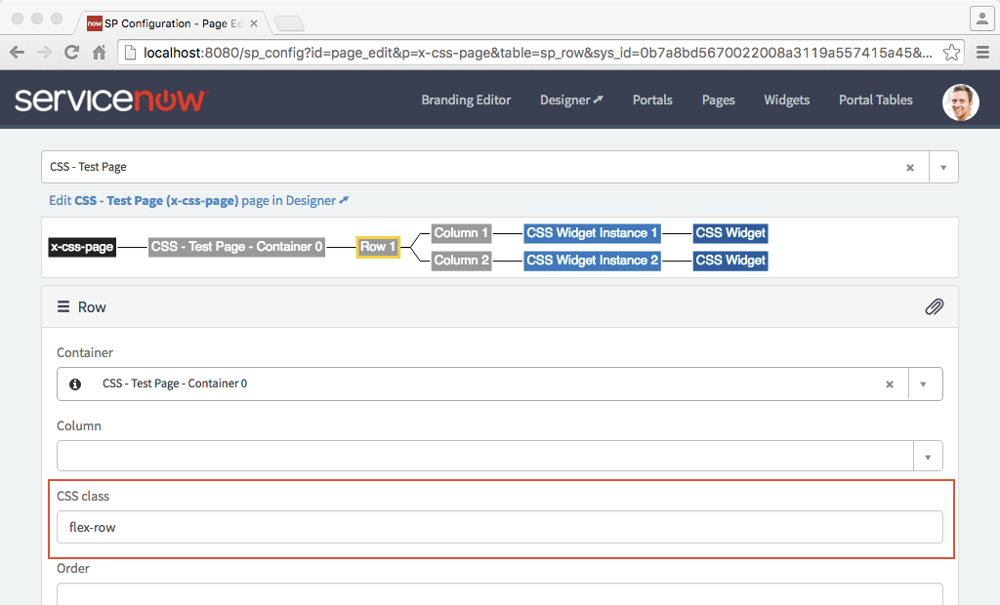
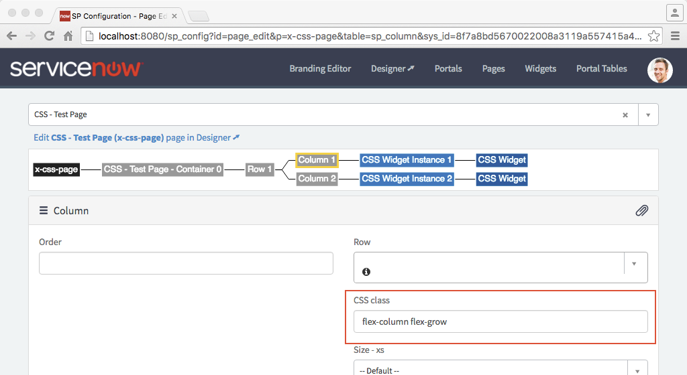
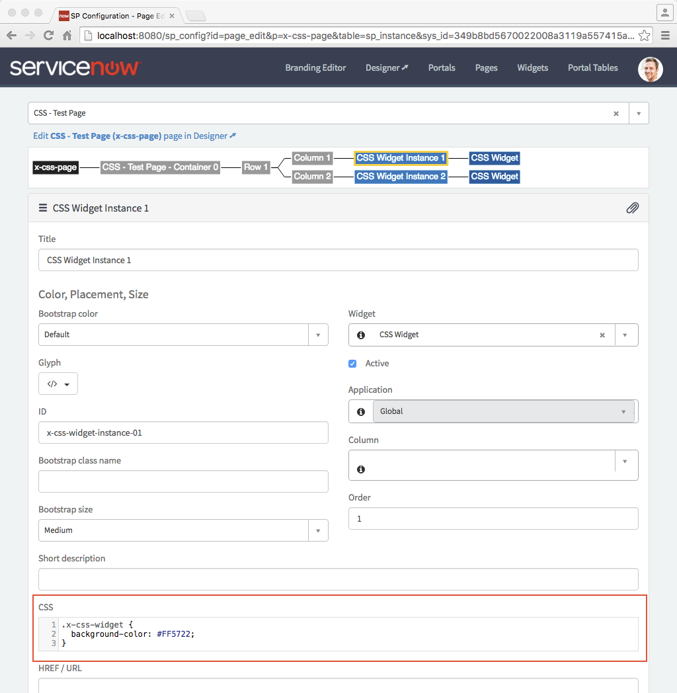
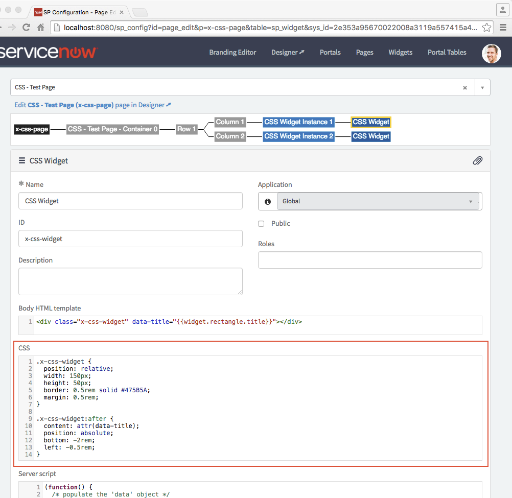

# Service Portal CSS

CSS rules for pages and widgets can be written using regular [CSS][10] or as [SCSS][20] syntax. Rules are scoped to the page or widget–this means that rules defined here affect just the page or widget and nothing else.


Table of Contents
-----------
1. [Service Portal Layout Model](#layout)
   * [Portal CSS](#portal)
   * [Page CSS](#page)
   * [Containers and Rows CSS](#container)
   * [Instances and Widget CSS](#instance-widget)
2. [SCSS Basic](#scss)
3. [List of functions][30]
4. [List of mixins][31]

Service Portal Layout Model <a name="layout"></a>
-----------
A portal is represented by pages with containers, rows and instances.



In /sp_config, the page edit tree will show the layout model hierarchy.



##### <a name="portal">Portal</a>

Portal CSS are editable in /sp_config portal edit. CSS variables and rules that are defined here are scoped and available to pages, containers, rows, and instances. Use portal css for global definitions shared by all pages.



##### <a name="page">Page</a>

Page CSS variables and rules are scoped and affects the page and all elements below.




##### <a name="container">Container</a>

Container CSS are defined by specificing a parent class or css class.




##### <a name="container-row">Row</a>

Row CSS are defined by specificing a CSS class.




##### <a name="container-column">Column</a>

Column CSS are defined by specificing a CSS class.




##### <a name="intance-widget">Widget Instance</a>

Instance CSS variables and rules are scoped and affects the widget instance.




##### <a name="widget">Widget</a>

Widget CSS variables and rules are scoped and affects the widget and all instances.



<a name="scss">SCSS Primer</a>
-----------

Service Portal SCSS is a subset of the [SASS Specification][20], the following are supported:
- [Variables](#variables)
- [Nesting](#nesting)
- [Operators](#operators)
- [Mixins](#mixins)

##### <a name="variables">Variables</a>

SCSS variables are a way to store information that you want to reuse throughout your stylesheet. You can store things like colors, font stacks, or any CSS value you think you'll want to reuse. SCSS uses the `$` symbol to make something a variable.

SCSS supports the follow data types:
- Numbers (including units)
- Strings (with quotes or without)
- Colors (name, or names)
- Booleans

Variables can also be arguments to or results from one of several available [functions][30] or [mixins][31]. During translation, the values of the variables are inserted into the output CSS document.

Here's an example:

``` scss
$font-stack:    Helvetica, sans-serif;
$primary-color: #333;

body {
  font: 100% $font-stack;
  color: $primary-color;
}
```

##### <a name="nesting">Nesting</a>

SCSS will let you nest your CSS selectors in a way that follows the same visual hierarchy of your HTML.

Here's an example of some typical styles:


``` scss
nav {
  ul {
    margin: 0;
    padding: 0;
    list-style: none;
  }

  li { display: inline-block; }

  a {
    display: block;
    padding: 6px 12px;
    text-decoration: none;
  }
}
```

You'll notice that the `ul`, `li`, and `a` selectors are nested inside the `nav` selector. This is a great way to organize your CSS and make it more readable. When the widget is rendered, the generated CSS would be something like this:

```scss
nav ul {
  margin: 0;
  padding: 0;
  list-style: none;
}

nav li {
  display: inline-block;
}

nav a {
  display: block;
  padding: 6px 12px;
  text-decoration: none;
}
```

##### <a name="operators">Operators</a>

SCSS has a handful of standard math operators like `+`, `-`, `*`, `/`, and `%`. In our example we're going to do some simple math to calculate widths for an aside `&` article.

```scss
.container { width: 100%; }

article[role="main"] {
  float: left;
  width: 600px / 960px * 100%;
}

aside[role="complementary"] {
  float: right;
  width: 300px / 960px * 100%;
}
```

The generated CSS will look like:

```css
.container {
  width: 100%;
}

article[role="main"] {
  float: left;
  width: 62.5%;
}

aside[role="complementary"] {
  float: right;
  width: 31.25%;
}
```

##### <a name="mixins">Mixins</a>

A mixin lets you make groups of CSS declarations that you want to reuse throughout your site. You can even pass in values to make your mixin more flexible. Here's an example for `border-radius`.

```scss
@mixin border-radius($radius) {
  -webkit-border-radius: $radius;
     -moz-border-radius: $radius;
      -ms-border-radius: $radius;
          border-radius: $radius;
}

.box { @include border-radius(10px); }
```

Here is the generated CSS:

```css
.box {
  -webkit-border-radius: 10px;
  -moz-border-radius: 10px;
  -ms-border-radius: 10px;
  border-radius: 10px;
}
```

Additional Resources
-----------
* [MDN CSS Documentation][10]
* [Sass/SCSS Reference][20]


[10]: https://developer.mozilla.org/en-US/docs/Web/CSS

[20]: http://sass-lang.com/documentation/file.SASS_REFERENCE.html

[30]: css_functions.md
[31]: css_mixins.md

[40]: page_css.md
[41]: widget_css.md
