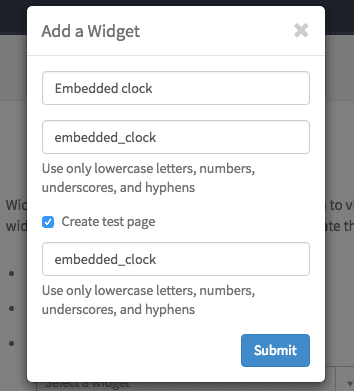
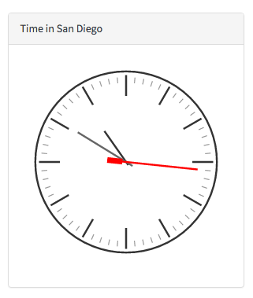
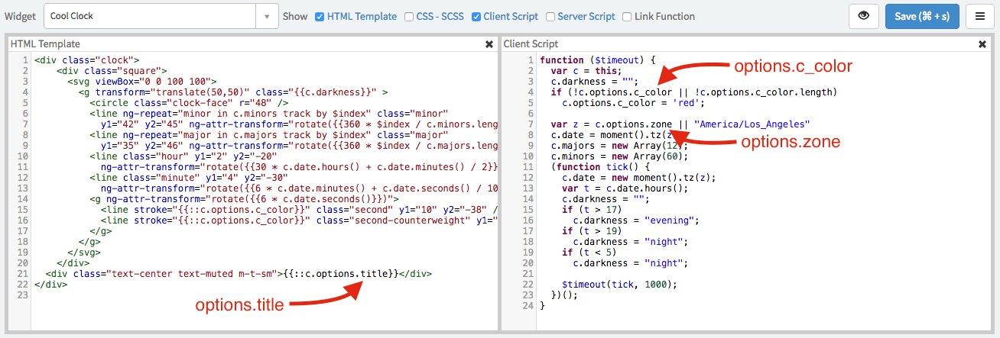
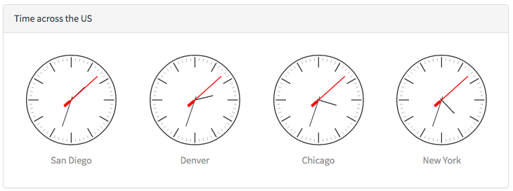

# Embedded Widgets

## \<sp-widget />
You can embed any widget inside of your widget’s [HTML template](widget_html.md) using the `sp-widget` directive. This directive requires a complete widget model which you can get using [spUtil.get()](#client_get) on the client or [$sp.getWidget](#server_get) in the [server script](/widget_server_script.md). The basic usage looks like this:

HTML Template  

```html
<sp-widget widget="c.myClockWidget"></sp-widget>
```   
<br />
Client Script

```javascript
function(spUtil) {
	var c = this;
	spUtil.get("widget-cool-clock").then(function(response) {
			c.myClockWidget = response;
	});
}
```

Examples
------

#### <a name="embedding_with_client_script" href="#embedding_with_client_script">#</a> Embedding a widget using client script

This example will show you how to create a new widget and test page, and how to embed the cool clock widget in a bootstrap panel.

1. First go to the widget editor: /sp_config?id=widget_editor

2. Click "Create a new widget" and use the following values  
   **Widget Name:** Embedded clock  
   **Widget Id:** embedded_clock  
   **Create a test page:** True  
   **Page Id:** embedded_clock  
   
   
3. Click **Submit**
4. Now, copy the following code blocks into your new widget:


HTML Template

```html
<div class="my-clock">
	<div class="panel panel-default ">
		<div class="panel-heading">Time in San Diego</div>
		<div class="panel-body">
			<sp-widget widget="c.myClockWidget"></sp-widget>
		</div>
	</div>
</div>
```
<br />
Client Script

```javascript
function(spUtil) {
	var c = this;
	spUtil.get("widget-cool-clock").then(function(response) {
			c.myClockWidget = response;
	});
}
```
<br />
CSS  

```css
.my-clock {
	margin: 25px;
	width: 300px;
	height: 300px;
}
```
<br />
Result  <br />
In a new browser window go to: /$sp.do?id=embedded_clock  



#### <a name="embedding_with_client_script_options" href="#embedding_with_client_script_options">#</a> Providing options to an embedded widget


This example builds off the first example to show you how to embed the cool clock widget with custom options. Each instance of the clock is provided a different timezone and title.

First, open the cool clock widget in the widget editor to see how it uses the options object for the title, second hand color, and the timezone.



Use the following code to fetch the widget model and provide the zone option after you fetch the widget model.

HTML

```html
<div class="panel panel-default">
  <div class="panel-heading">Time across the US</div>
  <div class="panel-body">
    <div class="row">
      <div class="col-sm-3" ng-repeat="myClock in c.clocks">
        <sp-widget widget="myClock"></sp-widget>
      </div>
    </div>
  </div>
</div>
```
<br />
Client Script

```javascript
function(spUtil) {
	var c = this;

	// Get the widget model
	spUtil.get("widget-cool-clock").then(function(response) {
		c.clocks = [];

		// Copy the widget model for each clock, and set the options
		var pacific = angular.copy(response);
		pacific.options = {zone: "America/Los_Angeles", title: "San Diego"};
		c.clocks.push(pacific);

		var mountain = angular.copy(response);
		mountain.options = {zone: "America/Denver", title: "Denver"};
		c.clocks.push(mountain);

		var central = angular.copy(response);
		central.options = {zone: "America/Chicago", title: "Chicago"};
		c.clocks.push(central);

		var eastern = angular.copy(response);
		eastern.options = {zone: "America/New_York", title: "New York"};
		c.clocks.push(eastern);
	});
}
```
<br />
Result  
In a new browser window go to: /$sp.do?id=embedded_clock  




#### <a name="embedding_with_server_script" href="#embedding_with_server_script">#</a> An example using server script
