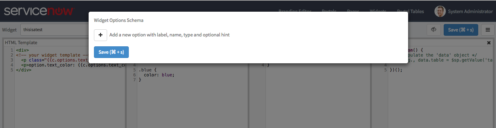

# Widget Options
In Service Portal, users can configure widgets embedded on pages through the power of **Widget Instances** (for more on this topic, read [Widget Instances](/widget_instances.md) and return here for more).

Now, let's go over how a Widget Developer could define an option schema within their own widgets to enable this level of configurability.

### Defining Option Schemas
An **option schema** is a way of defining what properties users of your widgets can define. Any properties declared here will be surfaced when a user is editing the instance of a widget. Here, you can enable users to declare many types of fields, from primitive String and Numbers to reference fields.

To do this, you will need to navigate to the Widget Editor and select the widget you wish to edit. In the top-right corner of the screen, select the hamburger icon and click the item called **Edit Option Schema**.

You should be presented with something that looks like this:

This is where you can add and subtract widget options, along with types and hints. From here, press the + icon and give it a label, a name (snakecase, like_this), a type, and a hint. Depending on the type you select, you may be prompted to provide additional fields.

Once you have provided your option(s), you can click the **Save** button and begin using them.

### Using Options in a Widget
Now, let's go over how to access options in a widget, as well as some best practices.
