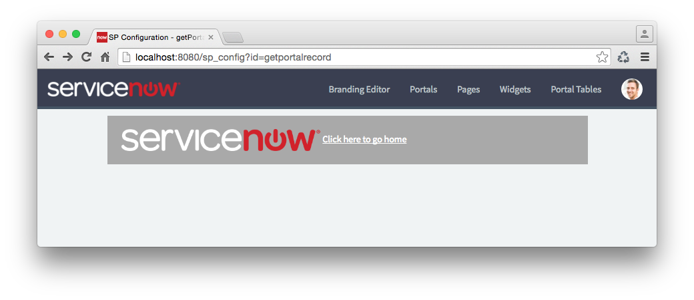

### $sp API
Service Portal provides a set of convenience methods found on the global `$sp` object, which is available in any widget server script.

| Method | Description |
| :------ | :----------- |
| [canReadRecord](#canReadRecord)(GlideRecord): boolean | Returns true if the user can read the specified GlideRecord. |
| [canReadRecord](#canReadRecord)(String, String): boolean | Returns true if the user can read the specified GlideRecord. |
| [getCatalogItem](#getCatalogItem)(String): Object | Returns a model and view model for a sc_cat_item or sc_cat_item_guide. |
| [getDisplayValue](#getDisplayValue)(String): String | Like [getValue](#getValue) except that it returns the display value. |
| [getField](#getField)(GlideRecord, String): Object | Returns {label, value, displayValue, type} for a given field on a GlideRecord. |
| [getFields](#getFields)(GlideRecord, String): Array | Like getField Checks the specified field names, and returns a comma seperated list of valid names. |
| [getFieldsObject](#getFieldsObject)(GlideRecord, String) | Checks the specified field names, and returns an object containing the valid names. |
| [getForm](#getForm)(String table, String sys_id, /*Optional String*/ encodedQuery, /*Optional String*/ view)|Returns the form|
| [getListColumns](#getListColumns)(String tableName, String view): |Returns a list of the specified table's columns in the specified view|
| [getMenuItems](#getMenuItems)(String sys_id): Array | Returns the menu items for the specified instance |
| [getMenuHREF](#getMenuHREF)(GlideRecord): String | Returns the (?id=) portion of the URL based on the sp_menu type. |
| [getParameter](#getParameter)(String): String | Returns the value of a given key from the query string or post body. |
| [getPortalRecord](#getPortalRecord)(): GlideRecord  | Returns the portal's GlideRecord. |
| [getRecord](#getRecord)(): Glide | Returns the GlideRecord for the current sp_instance\*. Returns null if the widget is embedded by another widget. |
| [getRecordDisplayValues](#getRecordDisplayValues) (Object, GlideRecord, String): void | Copies display values for the specified field names from a GlideRecord into the data parameter. |
| [getRecordElements](#getRecordElements)(Object, GlideRecord, String): void | Copies the value and display value for the specified field names from a GlideRecord into the data parameter. |
| [getRecordValues](#getRecordValues) (Object, GlideRecord, String): void | Copies values for the specified field names from a GlideRecord into the data parameter. |
| getStream(String, String): Object | Get the activity stream for a record. |
| getUserInitials() | Returns the user's initials as a string. |
| [getValue](#getValue)(String): Object | Returns a value from an object or GlideRecord in this order: <br/>1. The http request<br/> 2. The widget's sp_instance* record<br/>3. The current sp_portal record<br />or returns null |
| [getValues](#getValues)(Object, String): void | Copies values from the request or instance into the data parameter. |
| [getValues](#getValues)(Object): void | Copies values from the widget's sp_instance GlideRecord into the data parameter. |
| [getWidget](#getWidget)(String, Object): Object | Returns a widget model for embedding a widget inside another widget. |

<a name="getPortalRecord"></a> $sp.getPortalRecord
------
$sp.getPortalRecord(): GlideRecord

Useful for getting the current portal context. It returns the sp_portal GlideRecord if there is one.

Server Script

```javascript
(function() {
	var portalGr = $sp.getPortalRecord();
	data.logo = portalGr.getDisplayValue("logo");
	data.homepage = portalGr.getDisplayValue("homepage.id");
})();
```
<br />
HTML Template

```html
<div>
	
	<a href="?id={{::c.data.homepage}}">Click here to go home</a>
</div>
```
<br/>
Result


<a name="getWidget"></a> $sp.getWidget
-----

$sp.getWidget(String, Object): Object

Gets a widget by id or sys_id, executes that widget's server script using the provided options, then returns the widget model.

**Parameters**  

- (*String*) widget\_id  
   Can be a widget_id or widget sys_id.  
- (*Object*) options  
   An object to pass to the widget's server script. Refer to this object as **options** in your server script.
   
**Returns**  

A widget model to be used with \<sp-widget />.

```javascript
var w = $sp.getWidget('widget_id', {p1: param1, p2: param2});
```